# 🏗️ Technical Architecture & Pipeline

This document provides a comprehensive overview of the technical architecture, tooling pipeline, and Google Workspace integration for the Grasp Google Sheets extension ecosystem.

## 🎯 Overview

The Grasp project is a production-ready Google Apps Script extension ecosystem with modern TypeScript tooling, automated deployment pipeline, and comprehensive development workflow.

## 🔧 Development Pipeline

```mermaid
graph TD
    A[👨‍💻 Developer] -->|Edit| B[📝 TypeScript Source<br/>src/index.ts]
    B -->|Watch Mode| C[🔄 Rollup Bundler]
    C -->|Transpile| D[🔧 Babel Transform]
    D -->|Output| E[📦 JavaScript Bundle<br/>build/index.js]
    E -->|Auto-deploy| F[☁️ Google Apps Script]
    F -->|Deploy| G[📱 Google Sheets Extension]
    
    H[🛠️ Setup Script] -->|Automate| I[🏗️ Project Creation]
    I -->|Generate| B
    I -->|Configure| J[⚙️ Build Configuration]
    J --> C
    
    K[🔐 Google Auth] -->|clasp login| F
    L[📋 Google Sheets] -->|Install| G
    
    style A fill:#e1f5fe
    style G fill:#c8e6c9
    style F fill:#fff3e0
    style H fill:#f3e5f5
```



## 🛠️ Tooling Stack

### **Build System**
- **Rollup** - ES module bundler optimized for Google Apps Script
- **Babel** - JavaScript transpilation and polyfills
- **TypeScript** - Type safety and modern JavaScript features
- **npm-run-all** - Parallel task execution for watch mode

### **Development Environment**
- **Clasp CLI** - Google Apps Script command-line interface
- **Hot Reload** - Automatic compilation and deployment on file changes

### **Code Quality**
- **TypeScript Strict Mode** - Enhanced type checking
- **Google Apps Script Types** - Full API type definitions
- **ES2019 Target** - Modern JavaScript features with GAS compatibility

## 🏛️ Architecture Patterns

### **1. Modular Configuration**

```
project/
├── 📄 package.json         # Dependencies & scripts
├── 📄 tsconfig.json        # TypeScript configuration  
├── 📄 rollup.config.js     # Build pipeline setup
├── 📄 .babelrc            # Transpilation rules
├── 📄 .claspignore        # Deployment exclusions
├── 📄 appsscript.json     # Google Apps Script config
├── 📁 src/                # TypeScript source code
│   └── 📄 index.ts        # Main entry point
└── 📁 build/              # Compiled JavaScript (auto-generated)
    └── 📄 index.js        # Final deployed code
```

### **2. Build Pipeline Flow**


### **3. Google Apps Script Integration**

#### **Runtime Environment**
- **V8 Engine** - Modern JavaScript runtime with ES6+ support
- **Google Workspace APIs** - Native integration with Sheets, Drive, Gmail
- **Server-side Execution** - Cloud-based function execution
- **Cloud Logging** - Centralized error tracking and monitoring
- **ES2019 Support** - Modern JavaScript features including async/await, Promises, destructuring

### **4. Development Workflows**

#### **Production Workflow (grasp-final)**
```bash
# One-time setup
npm install
clasp login
clasp create --type sheets

# Development cycle
npm run watch
# ↳ Parallel execution:
#   - rollup -c --watch          (Auto-compile TypeScript)
#   - clasp push --force --watch (Auto-deploy on changes)
```

## 🔐 Authentication & Security

### **Google Apps Script Authentication**
- **OAuth 2.0** - Secure Google account integration
- **Scoped Permissions** - Minimal required access rights
- **clasp CLI** - Automated credential management

### **Security Best Practices**
- **No sensitive data in source** - Environment variables for secrets
- **Minimal permissions** - Only required Google Workspace scopes
- **Source code isolation** - Build artifacts excluded from deployment

## 📊 Performance Optimizations

### **Build Optimizations**
- **Tree Shaking Prevention** - Ensures all functions are available to GAS
- **ES Module Format** - Native Google Apps Script compatibility

## 🌐 Google Workspace Integration

### **Extension Lifecycle**
1. **Development** - Local TypeScript development with hot reload
2. **Testing** - Google Apps Script editor integration
3. **Publishing** - Google Workspace Marketplace (optional)
4. **Distribution** - Direct sharing or organization deployment

### **API Integration Points**
- **SpreadsheetApp** - Google Sheets manipulation
- **UrlFetchApp** - External API communication
- **PropertiesService** - Persistent storage
- **HtmlService** - Custom UI components

### **User Interface Integration**
- **Custom Menus** - Native Google Sheets menu integration
- **Sidebars** - Rich HTML/JavaScript panels
- **Dialogs** - Modal interaction windows
- **Toast Notifications** - Non-intrusive user feedback

## 🎯 Future Enhancements

### **Planned Improvements**
- **HTML Rendering System** - Modern UI framework integration (Astro, Vue.js, Lit, Alpine.js)
- **CI/CD Pipeline** - GitHub Actions integration
- **Multi-environment Support** - Development, staging, production environments

---

**Grasp Extensions** - Modern TypeScript development for Google Apps Script with automated deployment and production-ready architecture.
